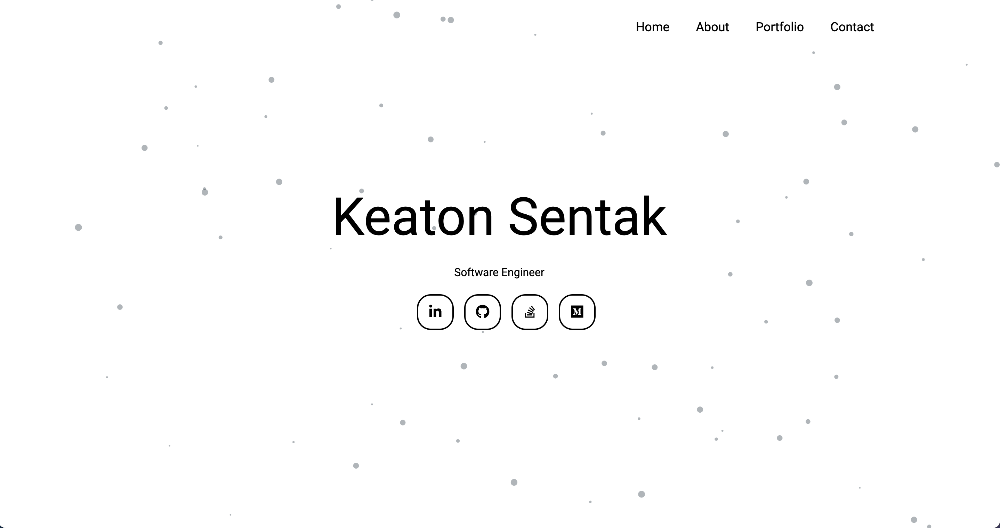

# My Gatsby Portfolio Site

This is the source code for my personal portfolio site. The site includes 4
pages: Home, About, Portfolio, & Contact. The `Home` page displays my social
links. Visitors can download a copy of my resume from the `About` page. The
`Portfolio` page hosts some of the projects I have built in my free time.
You can get in touch with me by filling out the form on the `Contact` page.

## Deployed Application

### https://keatonsentak.com/

## Built With

- React
- Gatsby
- TypeScript
- Bootstrap

## Author

Keaton Sentak - [Portfolio](https://keatonsentak.com) | [GitHub](https://github.com/ksentak)
